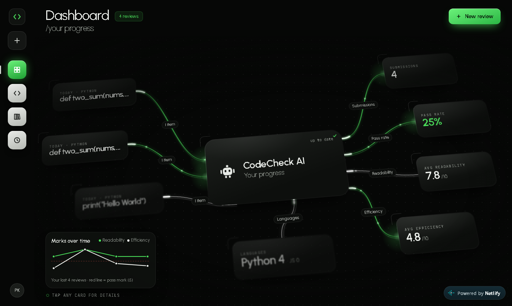
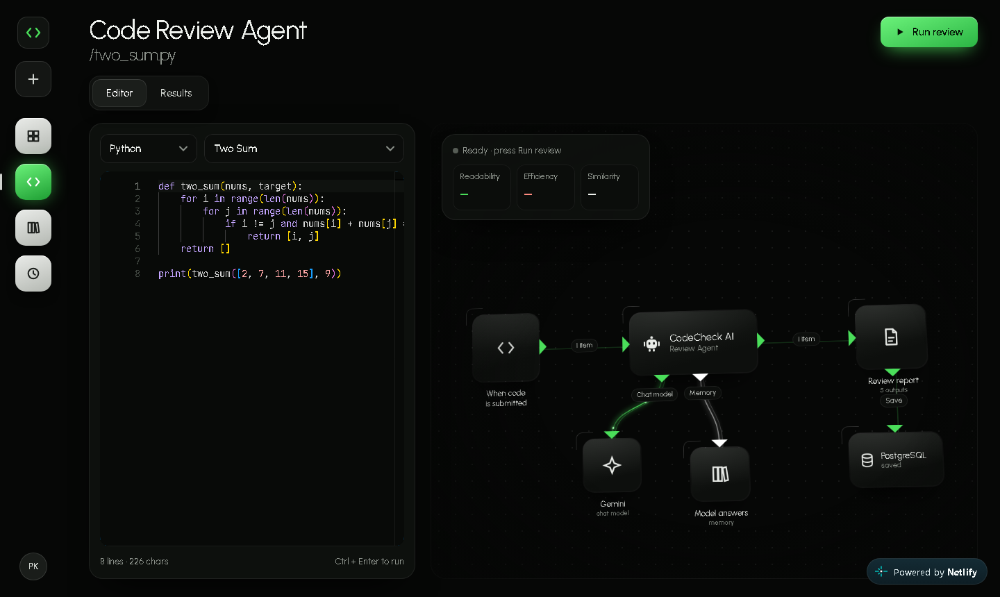
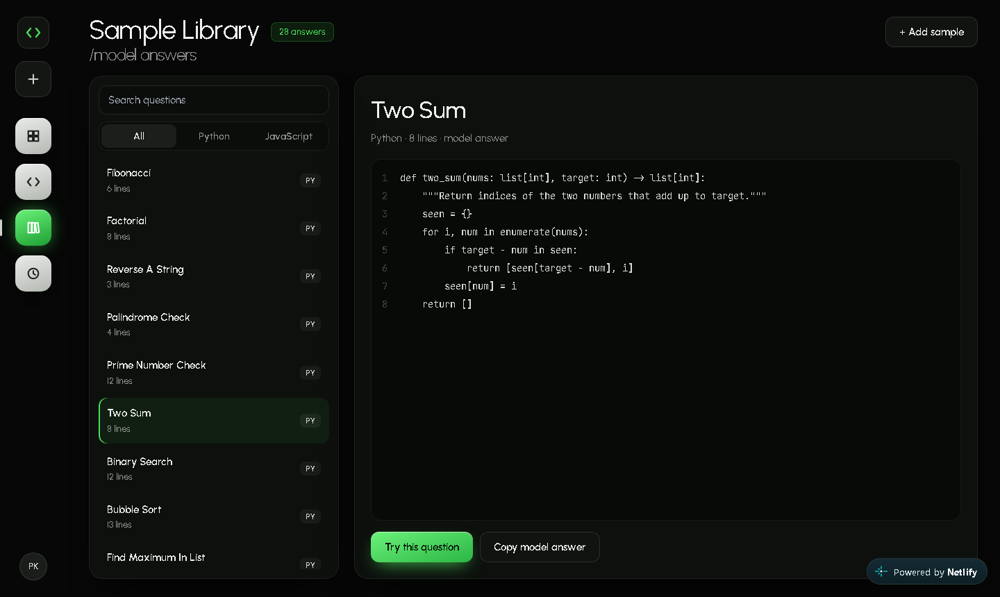
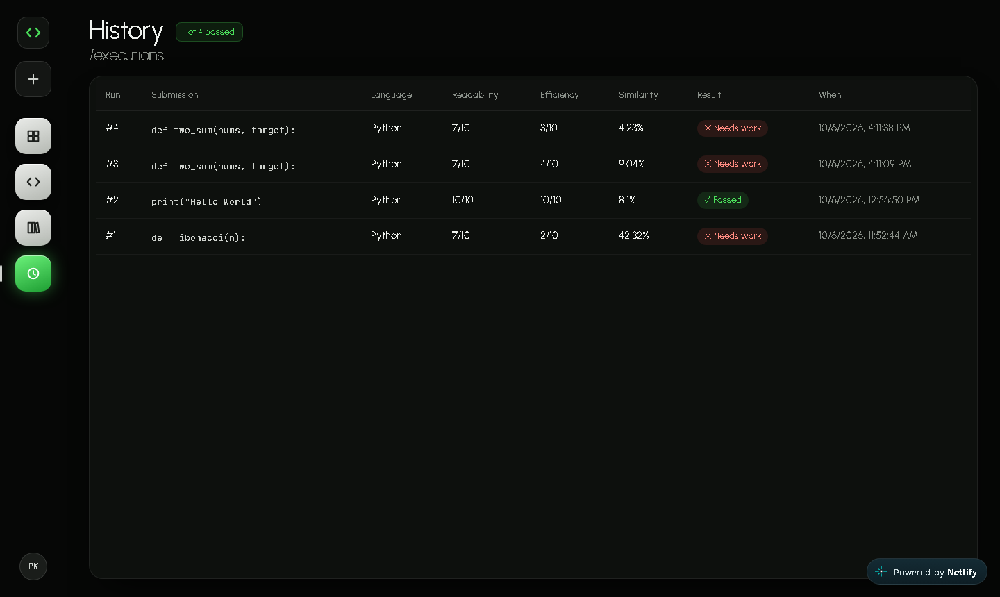
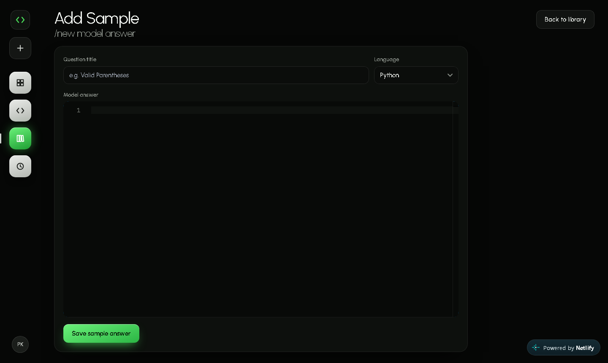

# 🤖 AI Code Reviewer (CodeCheck AI)


CodeCheck AI is a web application where you submit Python or JavaScript code and an AI review agent, powered by Google Gemini, returns **bugs**, **suggestions**, **readability** and **efficiency** scores, a **similarity score** against a model answer, and an **improved version** of your code. Every review is saved, and your progress is shown on an animated dashboard.

---

## 🌐 Live Demo

🚀 **[codereviewer8.netlify.app](https://codereviewer8.netlify.app/)**

> The backend runs on Render's free plan, so the first request after a while can take up to a minute while the server wakes up.

---

## 📸 Screenshots

<div align="center">
<table>
  <tr>
    <td colspan="2"></td>
  </tr>
  <tr><td colspan="2" align="center"><strong>Dashboard</strong>: your real stats as an animated agent graph. Tap any card for details.</td></tr>
  <tr>
    <td></td>
    <td></td>
  </tr>
  <tr>
    <td align="center"><strong>Mark code</strong>: editor and live review workflow</td>
    <td align="center"><strong>Sample library</strong>: model answers</td>
  </tr>
  <tr>
    <td></td>
    <td></td>
  </tr>
  <tr>
    <td align="center"><strong>History</strong>: every review, expandable</td>
    <td align="center"><strong>Add sample</strong>: new model answers</td>
  </tr>
</table>
</div>

---

## 🧠 Features

- **Review agent**: submit Python or JavaScript and Gemini reviews it like a senior engineer
- **Scores**: readability and efficiency out of 10, with a pass mark of 5
- **Bugs and suggestions**, with lines the AI mentions highlighted in the editor
- **Improved version** of your code, ready to copy
- **Similarity check** against a model answer (Python `difflib`)
- **Animated workflow**: the review pipeline (trigger → agent → Gemini + model answers → report → database) animates while the AI works
- **Dashboard**: real stats from the database as a node graph with flowing wires, plus a marks-over-time chart
- **Sample library**: 28 model answers (17 Python, 11 JavaScript) with search, language filter and "Try this question"
- **Add sample answers** and **submission history** with expandable reviews
- **Tap any card** for details; keyboard accessible; respects reduced-motion settings
- Clear error messages, for example when the free AI limit is reached or the server is waking up

---

## 💡 Tech Stack

**Frontend** (deployed on **Netlify**)

- React 19 + Vite, React Router
- Monaco Editor (the editor used in VS Code)
- Axios
- Custom CSS design system (`src/styles/app.css`) and an SVG node-graph engine (`src/lib/graph.js`)

**Backend** (deployed on **Render**)

- FastAPI + Uvicorn
- SQLAlchemy with PostgreSQL on **Neon** (SQLite when running locally)
- Google Generative AI SDK (Gemini Flash-Lite)

---

## 📁 Project Structure

```
AI-Code-Reviewer/
├── Backend/                    # FastAPI backend
│   ├── app/
│   │   ├── main.py             # API endpoints
│   │   ├── ai_utils.py         # Gemini prompt + response parsing
│   │   ├── models.py           # Database tables
│   │   ├── schemas.py          # Request/response models
│   │   └── database.py         # Database connection
│   └── requirements.txt
├── Frontend/                   # React + Vite frontend
│   ├── src/
│   │   ├── components/Rail.jsx # Left navigation
│   │   ├── lib/                # api.js, graph.js, editorTheme.js
│   │   ├── pages/              # Dashboard, SubmitCode, SampleAnswerList,
│   │   │                       # AddSampleAnswer, SubmissionHistory
│   │   ├── styles/app.css      # Design system
│   │   └── App.jsx
│   └── vite.config.js
├── docs/screenshots/           # README screenshots
├── netlify.toml                # Netlify build settings
├── render.yaml                 # Render deployment settings
└── README.md
```

---

## 🔌 API

| Method | Endpoint | Purpose |
|---|---|---|
| POST | `/submit-code` | Review code with Gemini and save the result |
| POST | `/add-sample-answer` | Add a model answer |
| GET | `/sample-questions` | List model answers |
| GET | `/submission-history` | List past reviews |

Interactive API docs: `/docs` on the backend.

---

## 🔧 Run Locally

### Backend

```bash
cd Backend
python -m venv venv
venv\Scripts\activate          # macOS/Linux: source venv/bin/activate
pip install -r requirements.txt

# Backend/.env
# GEMINI_API_KEY=your-api-key
# GEMINI_MODEL=models/gemini-flash-lite-latest   (optional)
# DATABASE_URL=postgresql://...                  (optional, SQLite is used without it)

uvicorn app.main:app --reload
```

### Frontend

```bash
cd Frontend
npm install

# Frontend/.env
# VITE_API_BASE_URL=http://localhost:8000

npm run dev
```

Get a free Gemini API key at [aistudio.google.com/apikey](https://aistudio.google.com/apikey).

---

### 📝 License

## MIT License © 2025 Vashu Singh, Praveen Kumar V

### Acknowledgments

- [FastAPI](https://fastapi.tiangolo.com/)
- [React](https://react.dev/)
- [Vite](https://vitejs.dev/)
- [Monaco Editor](https://microsoft.github.io/monaco-editor/)
- [Google Gemini](https://ai.google.dev/)
- [Netlify](https://www.netlify.com/)
- [Render](https://render.com/)
- [Neon](https://neon.tech/)
